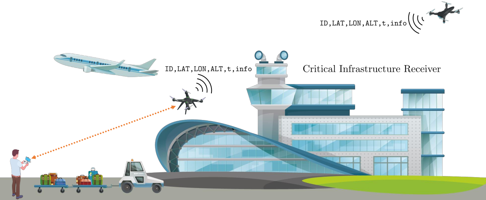
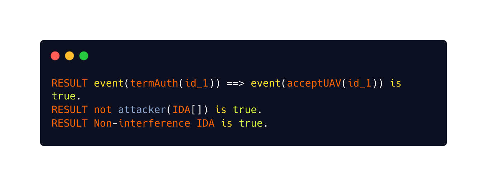

<p align="center">
  
</p>

# Anonymous Remote IDentification of Unmanned Aerial Vehicles (ARID)
ARID provides anonymous remote identification for drones and UAVs.

<p align="center">
  
</p>

Our implementation, whose source code has been publicly released as open-source, leverages popular libraries and tools, such as the Poky OS (a reference distribution of the Yocto Project), MAVLink, and OpenSSL, supported by the large variety of commercial UAVs. These features contribute to enhancing the impact of ARID, demonstrating its deployability to improving the quality of the provided security services in real-world UAV systems.

The details will be provided in the paper.

## How to Compile
To compile from source or use a different security level for ```arid.c```, select the correspondent elliptic curve and use the following command:
```sh
arm-linux-gnueabihf-gcc -I ./mavlink-solo/build/common/ -I /usr/local/openssl/include/ -I /usr/local/include/ -L /usr/local/openssl/lib/ -mcpu=cortex-a9 -o arid arid.c -lcrypto -lpthread -Wl,--no-as-needed -ldl -static
```

## Hardware Requirements
In order to setup the environment, you need the following equipment:
- A laptop equipped with GNU/Linux distro, the GNU Arm Embedded Toolchain: ```sudo apt-get install gcc-arm-linux-gnueabihf g++-arm-linux-gnueabihf```
- Check if the UAV/Drone supports the ```libssl.so.1.0.0```. In this case you need to compile the OpenSSL 1.0 for ARM and install the library on the UAV/Drone.
- A software like Wireshark/tcpdump to verify the received packets on your laptop ``` sudo apt-get install -y tcpdump wireshark```.
- A programmable drone (like the 3DR Solo Drone adopted in this contribution) that supports ELF 32-bit LSB executable.
- (optional) An ALFA Card AWUS036NH connected to the laptop.

## Security Level
In order to set a different security level, you can uncomment the correspondent elliptic curve (and the relative buffer). Following table provides information about the different security levels. Finally, compile the program and upload it on the drone.

<table>
  <tr>
    <th style="text-align:center"><b>Security Level (bits)</b></th>
    <th><i><b>Description</b></i></th>
  </tr>
  <tr>
    <td style="text-align:center">80</td>
     <td>With the elliptic curve <i>secp160r1</i> the total size of the MavLink payload is 147 bytes.</td>
  </tr>
  <tr>
    <td style="text-align:center">96</td>
    <td>With the elliptic curve <i>secp192k1</i> the total size of the MavLink payload is 163 bytes.</td>
  </tr>
  <tr>
    <td style="text-align:center">112</td>
    <td>With the elliptic curve <i>secp224k1</i> the total size of the MavLink payload is 179 bytes.</td>
  </tr>
  <tr>
    <td style="text-align:center">128</td>
    <td>With the elliptic curve <i>secp256k1</i> the total size of the MavLink payload is 195 bytes.</td>
  </tr>
</table>

### Example
```C
#define EC_NID NID_secp160r1
#define BUFFER_LENGTH 4 + 40 + 9 + 4 + 10
```

## Network Broadcast Address
The ARID frame can also be broadcast on all attached networks by sending to the special address ```INADDR_BROADCAST```.
```C
targetAddr->sin_addr.s_addr = INADDR_BROADCAST;
//targetAddr->sin_addr.s_addr = inet_addr("10.1.1.255");
```

## Change UAV/Drone MAC Address
It is easy to change the UAV/Drone MAC address. You just need to open an SSH session with the drone and execute the script ```change_mac.sh``` inside the drone before the flight. In this case you will not reveal your legitimate MAC address to potential adversaries.
```sh
ifconfig wlan0 down
ifconfig wlan0 hw ether 12:34:56:78:12:34
ifconfig wlan0 up
ifconfig
```

## Formal verification with ProVerif
The security properties of `ARID` have been verified formally and experimentally by using the open-source tool <a href="https://prosecco.gforge.inria.fr/personal/bblanche/proverif/">ProVerif 2.02pl1</a>, demonstrating enhanced security protection with respect to state-of-the-art approaches.

In order to test the security properties, download the file <a href="./proverif/arid.pv">arid.pv</a> and run: `./proverif arid.pv | grep "RESULT"`.

<p align="center">
  
</p>

## Credits
Credits go to the original authors of EC ElGamal protocol (blanclux) and OpenSSL 1.0.0 library for ARM whose original efforts made this possible.

## Contributing
Contributions are what make the open source community such an amazing place to be learn, inspire, and create. Any contributions you make are greatly appreciated.
- Fork the Project
- Create your Feature Branch (```git checkout -b feature/aridfeature```)
- Commit your Changes (```git commit -m 'Add some aridfeature'```)
- Push to the Branch (```git push origin feature/aridfeature```)
- Open a Pull Request

## Disclaimer
Any actions and or activities related to the material contained within this github repository is solely your responsibility. The misuse of the information in this repository can result in criminal charges brought against the persons in question. The author(s) will not be held responsible in the event any criminal charges be brought against any individuals misusing the information in this repository to break the law.

## Developers
Anonymous Authors

## License
```ARID``` is released under the GNU General Public License v3.0 <a href="LICENSE">license</a>.
